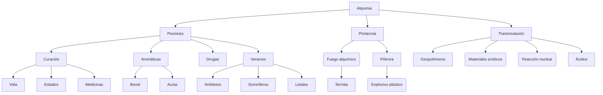

# Alquimia

```mermaid
flowchart TD
	Alquimia --> Pociones & Pirotecnia & Transmutación
		Pociones --> Curación & Aromáticas & Drogas
			Curación --> Vida & Estados & Medicinas
			Aromáticas --> Boost & Auras
		Pociones --> Venenos 
			Venenos --> Antídotos & Somníferos & Letales
		Pirotecnia --> Fuego("Fuego alquímico") & Pólvora
			Fuego --> Termita
			Pólvora --> ExplPlas("Explosivo plástico")
		Transmutación --> Geopolímeros & MatEx("Materiales exóticos") & ReacNuc("Reacción nuclear") & Ácidos
		 
```