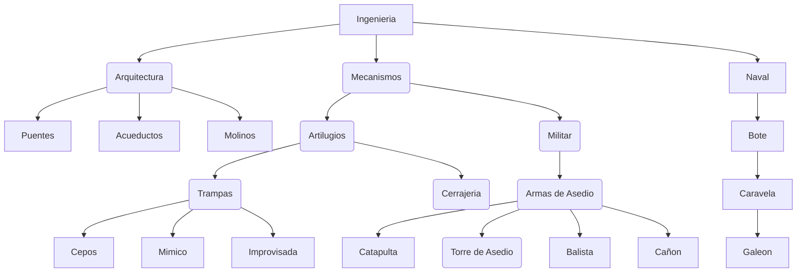

# Ingeniería

```mermaid
flowchart TD
    A[Ingenieria] --> Arq(Arquitectura)
        Arq --> Puentes
        Arq --> Acueductos
        Arq --> Molinos
            A --> Mec(Mecanismos)
                Mec --> Art(Artilugios)
                    Art --> Tram(Trampas)
                        Tram --> Cepos
                        Tram --> Mimico
                        Tram --> Improvisada
                    Art --> C(Cerrajeria)
                Mec --> Mili(Militar)
                    Mili--> Asedio(Armas de Asedio)
                        Asedio --> Catapulta
                        Asedio --> T(Torre de Asedio)
                        Asedio --> Balista
                        Asedio --> Cañon
    A --> Naval
        Naval --> Bote
        Bote --> Caravela
        Caravela --> Galeon          
```